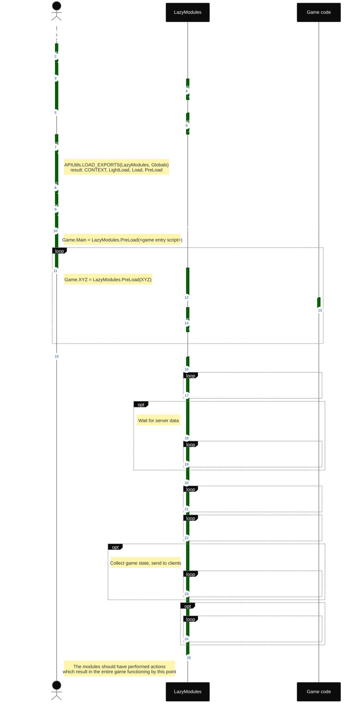

# Local initialization

```mermaid
%%{
init: {
	'theme': 'base',
	'themeVariables': {
		'darkMode': true,
		'boxBorderColor': '#FFFFFF',
		'primaryColor': '#0c0c0c',
		'primaryTextColor': '#FFFFFF',
		'primaryBorderColor': '#808080',
		'primaryBorderColor': '#808080',
		'lineColor': '#F8B229',
		'secondaryColor': '#006100',
		'tertiaryColor': '#0f0f0f'
    }
}
}%%
sequenceDiagram;
	autonumber
	actor Ctx as Client or server
	participant LM as LazyModules
	participant GC as Game code


	Ctx ->>+ Ctx: Startup.<context>.lua
	Ctx ->> Ctx: require(Game)
	Ctx -->> LM: require(LazyModules)
	activate LM
		LM ->> LM: Generate LM API
	deactivate LM
		Ctx ->>- LM: LazyModules:__init(Game)
	activate LM
		LM ->> LM: (SafeRequire, Signals, Tests, Error):__init
	deactivate LM

	activate Ctx
	Ctx -->> Ctx: Load LazyModules API into Game obj
	Note right of Ctx: APIUtils.LOAD_EXPORTS(LazyModules, Globals)<br>result: CONTEXT, LightLoad, Load, PreLoad

	Ctx ->> Ctx: PreLoad StdLib, load its API into Game obj
	Ctx ->> Ctx: Store custom core-functionality into Game obj
	Ctx -->> GC: PreLoad Main script
	Note right of Ctx: Game.Main = LazyModules.PreLoad(<game entry script>)
	loop Preload Other modules
		Ctx ->>+ LM: PreLoad
		deactivate Ctx
		Note right of Ctx: Game.XYZ = LazyModules.PreLoad(XYZ)
		LM ->>- GC: require, compile module

		activate GC
		GC ->>+ LM: return value
		deactivate GC
		LM ->> LM: store module value
		deactivate LM
	end
	Ctx ->> LM: (Startup->Game->LazyModules).Begin()
	activate LM
		LM -->> GC: Game.Main::__init(Game)
		loop For each PreLoad
			LM -->> GC: module::__init(Game)
		end

		opt Is Client?
			note Left of LM: Wait for server data
			LM -->> GC: __load_data(datastore)
			loop For each PreLoad
				LM -->> GC: module::__load_gamestate(serial, loaded: func, after: func)
			end
		end

		LM -->> GC: Signals::__finalize(Game)
		loop For each PreLoad
			LM -->> GC: module::__finalize(Game)
		end

		loop For each PreLoad
			LM -->> GC: module::__run(Game)
		end

		opt Is Server?
			note Left of LM: Collect game state, send to clients
			loop For each PreLoad
				LM -->> GC: module::__get_gamestate(plr)
			end
		end

		opt Is Testing?
			loop For each PreLoad
				LM -->> GC: module:__tests(G, T)
			end
		end
		LM ->> Ctx: Startup COMPLETE!
	deactivate LM

	note Right of Ctx: The modules should have performed actions<br>which result in the entire game functioning by this point
```